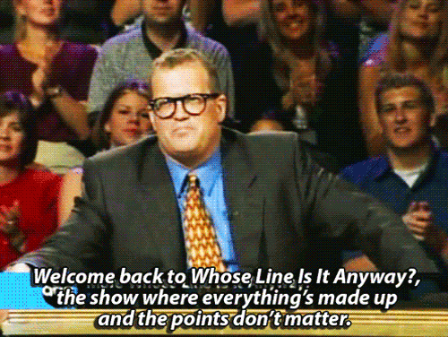

# Introduction to Programming

## Teachers Presentation

- Gerardo Rendon
    - https://scisa.com.mx
    - https://monoestereo.com.mx

- Luis Dominguez
    - https://monoestereo.com.mx

- Teacher Assistant (Mikasa Y Ada)
    
    

## What to expect from this course

- Learn basics
- Learn by doing
- Project style

## Class Presentation

- Nombre
- Edad
- Profesion
- Hobbies
- Que esperan del curso

## Course Objective

- Learn the life cycle of web applications build
- Actually build something

## Class Grade


## [Syllabus](./README.md)

## History

- History?
    - ENIAC
    - BULB
- What is a transistor?
    
- Why is the greatest invention of the last century?
    >Transistors transformed the world of electronics and had a huge impact on computer design. Transistors made of semiconductors replaced tubes in the construction of computers. By replacing bulky and unreliable vacuum tubes with transistors, computers could now perform the same functions, using less power and space.


## Who is George Boole? And why does HE matter?

- Father of Boolean Algebra
- 0 and 1 That's it

### Basic

- NOT   | !
- AND   | &&
- OR    | ||
- Has arithmetic importance (parenthesis or brackets)
- Parenthesis First
- LEFT TO RIGHT
- TOP TO BOTTOM

### Thruth Table

#### NOT
| A | *!A*  |
| - | --    |
| 0 | *1*   |
| 1 | *0*   |

#### AND

| A | B | *A & B* |
| - | - | ----- |
| 0 | 0 |   *0*   |
| 0 | 1 |   *0*   |
| 1 | 0 |   *0*   |
| 1 | 1 |   *1*   |

#### OR
| A | B | *A OR B* |
| - | - | ------ |
| 0 | 0 |   *0*    |
| 0 | 1 |   *1*    |
| 1 | 0 |   *1*    |
| 1 | 1 |   *1*    |


#### Example
- (A AND B) OR (A AND C)

### Exercises

- (A AND B) OR C
- !A OR B OR C
- (A OR B) AND !C

## Linux Installation (Excercise)

- Docker Installation
- Git installation
- VSCode installation

## Basic Bash

| command   | description |
| -------   | ----------- |
| .         | Current Directory  |
| ..        | Precious Directory |
| cd        | Change Directory |
| ls        | List Directory |
| pwd       | Current Directory Path |
| rm        | Remove File |
| touch     | Touch File |
| man       | Manual of command |
| echo      | print |
| cat       | Display content |
| chmod     | Change file permissions |
| chown     | Change file ownership |
| mkdir     | Make Directory |
| whereis   | Find Binary |
| export    | Add variable |
| whoami    | Show your username |

### Arguments
- `--help or -h for help`
- `-r recursive`
- `-f force`
- `-v verbose`
- `-d run in background OR & at the end`

### Bash Variables

- `echo $HOME`
- Getting to know .bashrc
- aliases
- `PATH=$PATH:~/opt/bin`

### Bash Shortcuts

| Shortcut | Description |
| -------- | ----------- |
| CTRL - C | Stop current command |
| CTRL - Z | Sleep current command |
| CTRL - R | Search command |
| UP        | last command |
| DOWN      | next command |

### Unix Permissions


- Read
- Write
- Execute

- User Permissions
- Group Permissions
- Other Permissions

### Scripting

- `#!/usr/bin/env bash`

### Sudo

- Become a superuser
- Users can be added to sudoers
- `sudo su`
- `$ vs #`
- Be Careful

### How to exit vim

`:wq`
`:q`

### Bash Excercise

1. Startup a new terminal with CTRL + T or win WIN key plus tipying terminal and ENTER
2. You start in squiggly (~) [Tilde]. Squiggly is where home is or where $HOME is
3. See all the contents of your home
    3.1 See all the contents of your home including hidden folders 
4. Create a new folder where you will do your work ~/bird_class
5. Change Directory to your freshly created folder
6. Create a new empty script
7. Give the script the execute permission
8. Lets write some script
```
#!/bin/bash
N_LINE=$(( $(tput lines) - 1));
N_COLUMN=$(tput cols);

function get_char {
    RANDOM_U=$(echo $(( (RANDOM % 9) + 0)));
    RANDOM_D=$(echo $(( (RANDOM % 9) + 0)));
    
    #https://unicode-table.com/en/#kangxi-radicals
    CHAR_TYPE="\u04"

    printf "%s" "$CHAR_TYPE$RANDOM_D$RANDOM_U";
}


function cursor_position {
    echo "\033[$1;${RANDOM_COLUMN}H";
}

function write_char {
    CHAR=$(get_char);
    print_char $1 $2 $CHAR
}

function erase_char { 
    CHAR="\u0020" #Space char
    print_char $1 $2 $CHAR
}

function print_char {
    CURSOR=$(cursor_position $1);
    echo -e "$CURSOR$2$3";
}


function draw_line {    
    RANDOM_COLUMN=$[RANDOM%N_COLUMN];
    RANDOM_LINE_SIZE=$(echo $(( (RANDOM % $N_LINE) + 1)));
    SPEED=0.05

    COLOR="\033[32m"; #GREEN
    COLOR_HEAD="\033[37m"; #WHITE

    #Draw Line
    for i in $(seq 1 $N_LINE ); do 
        write_char $[i-1] $COLOR;
        write_char $i $COLOR_HEAD;
        sleep $SPEED;
        if [ $i -ge $RANDOM_LINE_SIZE ]; then 
            erase_char $[i-RANDOM_LINE_SIZE]; 
        fi;
    done;

    #Erase Line
    for i in $(seq $[i-$RANDOM_LINE_SIZE] $N_LINE); do 
        erase_char $i
        sleep $SPEED;
    done
}

function matrix {
    tput setab 000 #Background Black
    clear
    while true; do
        draw_line & #Parallel
        sleep 0.5;
    done
}

matrix;

```
9. Run the script
10. STHAP the script
11. Change the ownership to root
12. Remove the permission to run as other
13. Try to run the script
14. Try to run as sudo
15. STHAP
16. Return to home
17. Create nested folders ~/new_folder/new_folder_1
18. Touch new 2 files one for each folder
>~/new_folder/sharks.txt

>~/new_folder/new_folder_1/turtles.txt
19. Copy all the contents of new_folder into bird_class (hint: -r)
20. Verify everything was copied correctly
21. Rename new_folder to something_else
22. Remove the contents of something_else (hint: -rf)

### Bash Links
- https://devhints.io/bash
- https://cheatography.com/davechild/cheat-sheets/linux-command-line/


## Git Basics

### Create an account

- https://github.com
- Your public Portfolio

### Open Source VS Closed Source


#### Why Go Open Source
https://opensource.com/life/15/12/why-open-source

### Remote, Local, Staged


### Commands

| command | description |
| ------- | ----------- |
| git add  | Add to staged |
| git commit | Add from staged to Local |
| git push | Add from local to remote |
| git fetch | Get changes from remote |
| git pull | Get changes into working directory |
| git merge | Merge changes from X branch to Y branch |
| git checkout | Revert file to the last commited version |
| git restore --staged | Return files to Unstaged. Reverse git add |
| git reset HEAD~1 | Uncommit 1 commit |
| git remote add origin link | Add a new remote called origin |
| git remote -v | List all remotes |
| git diff | See changed Unstaged |
| git log | See the tree |
| git status | See the current state of git repo |
| git clone | Clone a new repo |

### Git Log

`git log --all --graph --decorate --online`
- VSCode git graph
- SourceTree
- Git Kraken

### .GitIgnore

- Do not upload shit into the server
- .gitignore for X type of repo

### Git Exercises

1. Create a "repository" (project) with a git hosting tool (like Bitbucket)
2. Copy (or clone) the repository to your local machine
3. Add a file to your local repo and "commit" (save) the changes
4. "Push" your changes to your main branch
5. Make a change to your file with a git hosting tool and commit
6. "Pull" the changes to your local machine
7. Create a "branch" (version), make a change, commit the change
8. Open a "pull request" (propose changes to the main branch)
9. "Merge" your branch to the main branch
Get


### Real Life Git Excercise
1. Clone https://github.com/klosterlight/the_way_of_the_bird
2. Branch from master to your unique branch
>You can put whatever in your pledge, but basicaly include that you are committed to finish the course
3. Add your pledge to your staged changes
4. Commit
5. Push to your branch
6. Create Pull Request
7. Wait for your Pull Request to be accepted

### Git Links

- https://www.freecodecamp.org/news/learn-the-basics-of-git-in-under-10-minutes-da548267cc91/
- https://learngitbranching.js.org/
- https://www.atlassian.com/git

### Critical Thinking
>Un día, un granjero fue al mercado y compró un lobo, una cabra y una col. Para volver a su casa tenía que cruzar un río. El granjero dispone de una barca para cruzar a la otra orilla, pero en la barca solo caben él y una de sus compras.
>
>Si el lobo se queda solo con la cabra se la come, si la cabra se queda sola con la col se la come.
>
>El reto del granjero era cruzar él mismo y dejar sus compras a la otra orilla del río, dejando cada compra intacta. ¿Cómo lo hizo?

https://scratch.mit.edu/projects/714983063/

https://www.innovationbound.com/articles/the-original-think-outside-the-box-puzzle#puzzle

https://www.mathsisfun.com/puzzles/path-plodding-puzzle.html


