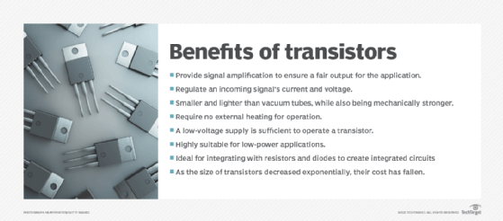
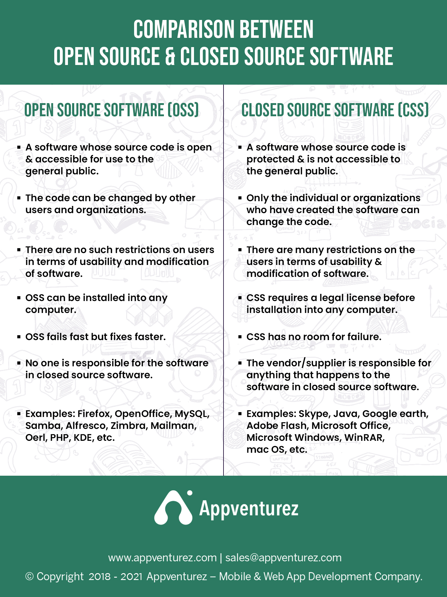

# Introduction to Programming

## Teachers Presentation

- Gerardo Rendon
    - https://scisa.com.mx
    - https://monoestereo.com.mx

- Luis Dominguez
    - https://monoestereo.com.mx

- Teacher Assistant (Mikasa Y Ada)
    
    

## What to expect from this course

- Learn basics
- Learn by doing
- Project style

## Class Presentation

- Nombre
- Edad
- Profesion
- Hobbies
- Que esperan del curso

## Course Objective

- Learn the life cycle of web applications build
- Actually build something

## [Syllabus](./README.md)

## History

- History?
    - ENIAC
    - BULB
- What is a transistor?
    
- Why is the greatest invention of the last century?
    >Transistors transformed the world of electronics and had a huge impact on computer design. Transistors made of semiconductors replaced tubes in the construction of computers. By replacing bulky and unreliable vacuum tubes with transistors, computers could now perform the same functions, using less power and space.

## Who is George Boole? And why does HE matter?

- Father of Boolean Algebra
- 0 and 1 That's it

### Basic

- NOT   | !
- AND   | &&
- OR    | ||
- Has arithmetic importance (parenthesis or brackets)
- Parenthesis First
- LEFT TO RIGHT
- TOP TO BOTTOM

### Thruth Table

#### NOT
| A | *!A*  |
| - | --    |
| 0 | *1*   |
| 1 | *0*   |

#### AND

| A | B | *A & B* |
| - | - | ----- |
| 0 | 0 |   *0*   |
| 0 | 1 |   *0*   |
| 1 | 0 |   *0*   |
| 1 | 1 |   *1*   |

#### OR
| A | B | *A OR B* |
| - | - | ------ |
| 0 | 0 |   *0*    |
| 0 | 1 |   *1*    |
| 1 | 0 |   *1*    |
| 1 | 1 |   *1*    |

#### Example
- (A AND B) OR (A AND C)

### Exercises

- (A AND B) OR C
- !A OR B OR C
- (A OR B) AND !C

## Linux Installation (Excercise)

- Docker Installation
- Git installation
- VSCode installation

## Basic Bash

| command   | description |
| -------   | ----------- |
| .         | Current Directory  |
| ..        | Precious Directory |
| cd        | Change Directory |
| ls        | List Directory |
| pwd       | Current Directory Path |
| rm        | Remove File |
| touch     | Touch File |
| man       | Manual of command |
| echo      | print |
| cat       | Display content |
| chmod     | Change file permissions |
| chown     | Change file ownership |
| mkdir     | Make Directory |
| whereis   | Find Binary |
| export    | Add variable |
| whoami    | Show your username |

### Arguments
- `--help or -h for help`
- `-r recursive`
- `-f force`
- `-v verbose`
- `-d run in background OR & at the end`

### Bash Variables

- `echo $HOME`
- Getting to know .bashrc
- aliases
- `PATH=$PATH:~/opt/bin`

### Bash Shortcuts

| Shortcut | Description |
| -------- | ----------- |
| CTRL - C | Stop current command |
| CTRL - Z | Sleep current command |
| CTRL - R | Search command |
| UP        | last command |
| DOWN      | next command |

### Unix Permissions

- Read
- Write
- Execute

- User Permissions
- Group Permissions
- Other Permissions

### Scripting

- `#!/usr/bin/env bash`

### Sudo

- Become a superuser
- Users can be added to sudoers
- `sudo su`
- `$ vs #`
- Be Careful

### How to exit vim
`:wq`
`:q`

### Bash Links
- https://devhints.io/bash
- https://cheatography.com/davechild/cheat-sheets/linux-command-line/

## Git Basics

### Create an account

- https://github.com
- Your public Portfolio

### Open Source VS Closed Source

#### Why Go Open Source
https://opensource.com/life/15/12/why-open-source

### Remote, Local, Staged

### Commands

| command | description |
| ------- | ----------- |
| git add  | Add to staged |
| git commit | Add from staged to Local |
| git push | Add from local to remote |
| git fetch | Get changes from remote |
| git pull | Get changes into working directory |
| git merge | Merge changes from X branch to Y branch |
| git checkout | Revert file to the last commited version |
| git restore --staged | Return files to Unstaged. Reverse git add |
| git reset HEAD~1 | Uncommit 1 commit |
| git remote add origin link | Add a new remote called origin |
| git remote -v | List all remotes |
| git diff | See changed Unstaged |
| git log | See the tree |
| git status | See the current state of git repo |
| git clone | Clone a new repo |

### Git Log

`git log --all --graph --decorate --online`
- VSCode git graph
- SourceTree
- Git Kraken

### .GitIgnore

- Do not upload shit into the server
- .gitignore for X type of repo

### Git Exercises

1. Create a "repository" (project) with a git hosting tool (like Bitbucket)
2. Copy (or clone) the repository to your local machine
3. Add a file to your local repo and "commit" (save) the changes
4. "Push" your changes to your main branch
5. Make a change to your file with a git hosting tool and commit
6. "Pull" the changes to your local machine
7. Create a "branch" (version), make a change, commit the change
8. Open a "pull request" (propose changes to the main branch)
9. "Merge" your branch to the main branch
Get

### Git Links

- https://www.freecodecamp.org/news/learn-the-basics-of-git-in-under-10-minutes-da548267cc91/
- https://learngitbranching.js.org/
- https://www.atlassian.com/git

### Critical Thinking