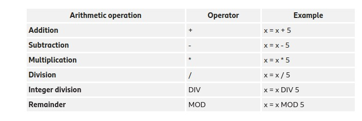
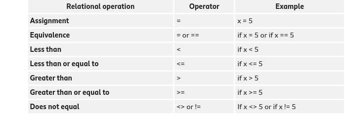
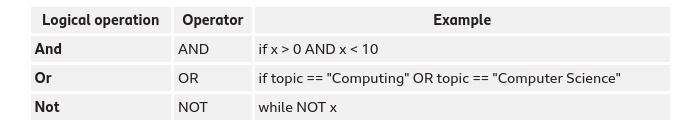
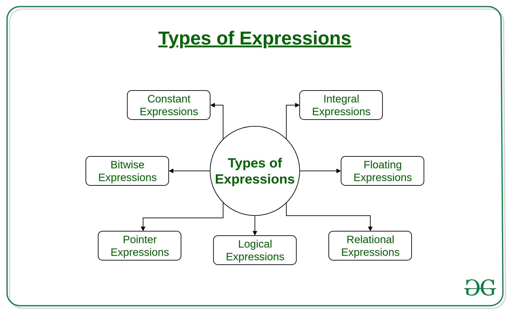
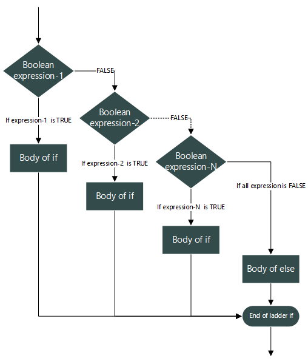

# Programming 101

## What is a programming language? What are they used for?

- Lexical       (Dictionary)
- Syntactical   (Rules)
- Semantical    (Rules that make sense)

## Types of Programming Languages

- Procedural Language
- Functional Language
- Scripting Language
- Imperative Language
- Object Oriented Language

## Compiled vs Interpreted

> Compiled => Ready for machine

> Interpreted => Ready at runtime

## Programming Languages

- C#
- C / C++
- Python
- Rust
- R
- Python
- Ruby
- Javascript
- Java
- Go
- Scala
- Prolog
- Swift

## What is a Framework? (See later OOP)
>basic structure underlying a system

## Flow Charts
>a data flow that shows the data flow while writing a program or algorithm

## What is a variable? And a constant?

>A constant does not change its value over time. A variable, on the other hand, changes its value dependent on the equation

## Types of variables

- int
- float, decimal, number, bidecimal, etc.
- char
- string
- bool
- Objects (See later in OOP)

## Types of operators

- Arithmetic

- Relational

- Logical


## What is an expression?


> An expression is any valid unit of code that resolves to a value

>An expression is a combination of operators, constants and variables. An expression may consist of one or more operands, and zero or more operators to produce a value.



## What is an statement?

> Multiple expressions. Can be 1 expression. Not all expressions are statements. An statement may have multiple expressions

## What is a Block?
>Multiple statements

## Assignment
```
var a = 0;
var b = a
a = a + 100
print(b)
```

## Cycles

- While
- Do While

- For

- Foreach (Later for OOP)

## Conditionals

- If/Else

- Switch


## Excercises