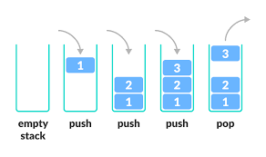

# Project Discussion

- Que proyecto vamos a realizar

# Programming 102

## Estructuras de Datos
>A data structure is a specialized format for organizing, processing, retrieving and storing data

### Linear Data Structures

1. Arrays
>List of similar values of fixed length

2. Linked List
>A linked list is a type of data structure that is easy to expand, contract, and reindex

3. Dictionary
>A dictionary is a general concept that maps unique keys to non-unique values. Go to Browser.

4. Queue
>FIFO Data structure

5. Stack
>LIFO Data Structure

### Non-Linear Data Structures
1. Graph
>a type of non-linear data structure that is used to store data in the form of nodes and edges

2. Tree
>In computer science, a tree is a widely used abstract data type that represents a hierarchical tree structure with a set of connected nodes

## Operaciones de Estructuras de Datos

1. Arrays
- Traverse − print all the array elements one by one.
- Insertion − Adds an element at the given index.
- Deletion − Deletes an element at the given index.
- Search − Searches an element using the given index or by the value.
- Update − Updates an element at the given index.
- https://www.w3schools.com/jsref/jsref_obj_array.asp

2. Linked lists
- Insert
    - At beginning
    - At the end
    - At a random point
- Delete
    - At beginning
    - At the end
    - At a random point

3. Dictionary
- Access value by key
- Iterate through the dictionary
- Has Key value
- Remove

4. Queue
- Queue
- Dequeue

5. Stack
- push(): Adds a single or multiple items to the top of the Stack.
- pop(): Removes and Returns the top item of the Stack.
- peek(): Returns the top item of the Stack.
- isEmpty(): Returns True if Stack is empty, False otherwise.
- clear(): Removes all the items from the Stack.
- size(): Returns the length of the stack.

### Excercises
- https://www.w3schools.com/js/js_arrays.asp
- https://codeburst.io/linked-lists-in-javascript-es6-code-part-1-6dd349c3dcc3
- https://livecodestream.dev/post/everything-you-should-know-about-javascript-dictionaries/
- https://www.freecodecamp.org/news/stack-5404d9735f88/

## Programacion Orientada a Objetos
>Object-Oriented Programming (OOP) is a programming approach based on objects and classes. The object-oriented paradigm allows us to organise software as a collection of objects that consist of both data/attributes and behaviours.

- Attributes

- Behaviour
    - Internal
    - Public

- Static methods
>A static method is part of a class definition, but is not part of the objects it creates.

- Inheritance

- Abstraction
>Hiding unnecessary details and functionalities and only showing what is important to work is an abstraction.

- Polymorphism
>To execute a single task in various ways is called polymorphism. For example, “to speak” is a method but is performed differently: a dog barks, a human speaks, a cat meows, a bird chirp, etc.

- Encapsulation
>the process of hiding and securing the properties of objects

### Excercises

1. Make a Person Walk
    - Make a person class
    - With attributes of height, weight, dob, name
    - With methods of getting his age
    - Walking
    - Say something
2. Have a bunch of animals
    - Base class Animal with basic attributes
        string animalType
        makeASound
    - Implement on Bird, Dog and Person

## Relationships

- One to One

- One to Many

- Many to Many

- Polymorphic

## Examples
- Biblioteca
- Tienda en Linea

# Web Programming Intro
>Web development is the work involved in developing a website for the Internet or an intranet. Web development can range from developing a simple single static page of plain text to complex web applications, electronic businesses, and social network services

>TCP/IP

## MVC
> Model, View, Controller

> pattern in software design commonly used to implement user interfaces, data, and controlling logic

### Model => Objects
>Representation of our objects

### Views => Visual Representation
>How the final user sees the data

### Controller => Routing, Permissions, Auth
>How the data gets delivered

## APIs
>Application Programming Interface

>You want to access the same data in many different places or ways

### Type of Actions
- GET
- POST
- PUT
- DELETE

### Type of params
- Query
- Body
- Url

## Basic HTML

## Basic CSS

## Basic JS

## Links
- https://medium.com/swlh/data-structures-101-e18fc33579fa
- https://www.stevethedev.com/blog/computer-science/arrays-linked-lists-and-dictionaries#:~:text=A%20linked%20list%20is%20a,performing%20random%2Daccess%20type%20tasks.
- https://www.w3schools.com/jsref/jsref_obj_array.asp
- https://codeburst.io/linked-lists-in-javascript-es6-code-part-1-6dd349c3dcc3
- https://livecodestream.dev/post/everything-you-should-know-about-javascript-dictionaries/
- https://www.softwaretesttips.com/oop-concept-abstraction/