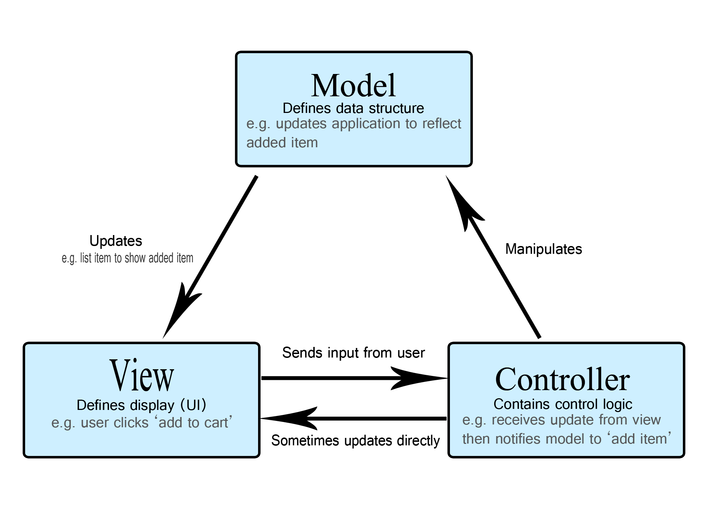

# Project Discussion

- Que proyecto vamos a realizar

# Programming 102

## Estructuras de Datos
>A data structure is a specialized format for organizing, processing, retrieving and storing data

### Linear Data Structures

1. Arrays
>List of similar values of fixed length


2. Linked List
>A linked list is a type of data structure that is easy to expand, contract, and reindex


3. Dictionary
>A dictionary is a general concept that maps unique keys to non-unique values. Go to Browser.

4. Queue
>FIFO Data structure


5. Stack
>LIFO Data Structure


### Non-Linear Data Structures
1. Graph
>a type of non-linear data structure that is used to store data in the form of nodes and edges


2. Tree
>In computer science, a tree is a widely used abstract data type that represents a hierarchical tree structure with a set of connected nodes


## Operaciones de Estructuras de Datos

1. Arrays
- Traverse − print all the array elements one by one.
- Insertion − Adds an element at the given index.
- Deletion − Deletes an element at the given index.
- Search − Searches an element using the given index or by the value.
- Update − Updates an element at the given index.
- https://www.w3schools.com/jsref/jsref_obj_array.asp

2. Linked lists
- Insert
    - At beginning
    - At the end
    - At a random point
- Delete
    - At beginning
    - At the end
    - At a random point

3. Dictionary
- Access value by key
- Iterate through the dictionary
- Has Key value
- Remove

4. Queue
- Queue
- Dequeue

5. Stack
- push(): Adds a single or multiple items to the top of the Stack.
- pop(): Removes and Returns the top item of the Stack.
- peek(): Returns the top item of the Stack.
- isEmpty(): Returns True if Stack is empty, False otherwise.
- clear(): Removes all the items from the Stack.
- size(): Returns the length of the stack.

### Excercises
- https://www.w3schools.com/js/js_arrays.asp
- https://codeburst.io/linked-lists-in-javascript-es6-code-part-1-6dd349c3dcc3
- https://livecodestream.dev/post/everything-you-should-know-about-javascript-dictionaries/
- https://www.freecodecamp.org/news/stack-5404d9735f88/

## Programacion Orientada a Objetos
>Object-Oriented Programming (OOP) is a programming approach based on objects and classes. The object-oriented paradigm allows us to organise software as a collection of objects that consist of both data/attributes and behaviours.

- Attributes

- Behaviour
    - Internal
    - Public

- Static methods
>A static method is part of a class definition, but is not part of the objects it creates.

- Inheritance


- Abstraction
>Hiding unnecessary details and functionalities and only showing what is important to work is an abstraction.

- Polymorphism
>To execute a single task in various ways is called polymorphism. For example, “to speak” is a method but is performed differently: a dog barks, a human speaks, a cat meows, a bird chirp, etc.

- Encapsulation
>the process of hiding and securing the properties of objects


### Excercises

1. Make a Person Walk
    - Make a person class
    - With attributes of height, weight, dob, name
    - With methods of getting his age
    - Walking
    - Say something
2. Have a bunch of animals
    - Base class Animal with basic attributes
        string animalType
        makeASound
    - Implement on Bird, Dog and Person

## Relationships

- One to One


- La empresa quiere registrar que carro empresarial tiene registrado cada uno de los empleados
- La empresa es critica con el tema de las vacaciones en donde unicamente se puede ir de vacaciones un empleado a la vez. La empresa quiere llevar registro de que dia de vacaciones se registra a cada empleado
- La biblioteca lleva registro de que personas utilizan sus booths para estudio individal. Unicamente puede haber una persona por booth

- One to Many


- La tiendita tiene categorias de productos y productos
- La tiendita quiere registrar todas las compras que haga el usuario. El usuario puede tener multiples compras
- El salon virtual tiene multiples estudiantes

- Many to Many


- Un estudiante puede estar en muchas clases y una clase puede tener muchos estudiantes
- Un producto puede ser utilizado por muchos proveedores y un proveedor puede tener muchos productos
- Un usuario puede registrar un centro de servicio para recolectar sus pedidos y un centro de servicio puede ser usado por multiples usuarios

- Polymorphic


### Excercises
- La universidad quiere llevar registro de que estudiantes estan registrados en que clase.
- Adicional tambien quiere llevar registro de que profesores dan que clases
- Tanto profesores como estudiantes pueden tener una beca alimenticia
- La universidad quiere llevar registro en que tienda han gastado su beca alimenticia tanto profesores como estudiantes

### Homework
- Un usuario puede comprar de las tiendas. Se registra una factura por cada compra
- El usuario tiene un solo registro de RFC. Este registro puede tener multiples facturas
- La factura puede ser de una tienda fisica o una tienda virtual
- Las tiendas pertenecen a un proveedor
- El usuario proveedor y el usuario cliente ambos tienen multiples fotos de su perfil

## Examples
- Biblioteca
- Tienda en Linea

# Web Programming Intro
>Web development is the work involved in developing a website for the Internet or an intranet. Web development can range from developing a simple single static page of plain text to complex web applications, electronic businesses, and social network services

>TCP/IP


## MVC
> Model, View, Controller

> pattern in software design commonly used to implement user interfaces, data, and controlling logic



### Model => Objects
>Representation of our objects

### Views => Visual Representation
>How the final user sees the data

### Controller => Routing, Permissions, Auth
>How the data gets delivered

## APIs
>Application Programming Interface

>You want to access the same data in many different places or ways

>Programming Language does not matter

### Type of Actions
- GET
    - `curl -X GET https://pokeapi.co/api/v2/berry/1`
- POST
    - `curl -X POST https://siglonet.scisa.com.mx/countries/save -H "Content-Type: application/json" -d '{ "name": "Gerardo Country", "shortName": "GRL",  "isoCode": "GRL", "uifCode": "GRL", "demonym": "GRL", "isTaxHaven": false, "isNonCooperating": false, "sepomexCode": "GRL", "cnbvCode": "GRL", "isBlocked": false, "isActive": true
    }'`
    - `curl -X POST https://siglonet.scisa.com.mx/countries/save -H "Content-Type: application/json" -d '{ "name": "Gerardo Country", "shortName": "GRR",  "isoCode": "GRR", "uifCode": "GRR", "demonym": "GRR", "isTaxHaven": false, "isNonCooperating": false, "sepomexCode": "GRR", "cnbvCode": "GRR", "isBlocked": false, "isActive": true
    }'`
    - `curl -X 'GET' \
  'https://siglonet.scisa.com.mx/currencies/get_by_iso_code?ISOCode=MXN' \
  -H 'accept: text/plain'`
- PUT
    - `curl -X PUT https://dummy.restapiexample.com/api/v1/update/21 -d '{"employee_name": "Gerardo"}'`
- DELETE
    - `curl -X DELETE https://siglonet.scisa.com.mx/countries/delete -H "Content-Type: application/json" -d '{ "id": 255, "version": 8191276964535861248 }'`


### Type of params
- Query
    >`?` AFTER route
    >`&` For additional params
    >Mosty used for GET
- Body
    >Used for POST to send data in the body of the request
    >GET requests do not have body
- Url
    >Used on any type of request for more structures routes

### HTML Responses

- https://en.wikipedia.org/wiki/List_of_HTTP_status_codes

## Basic HTML

- TAGS
    The HTML element is everything from the start tag to the end tag:
    <tagname>Content goes here...</tagname>

    Never Skip the End Tag

- MINIMUM HTML
    <!DOCTYPE html>
    <html>
      <body>
       <h1>My First Heading</h1>
       <p>My first paragraph.</p>
      </body>
    </html>

- HTML Headings
    <h1> to <h6>

- HTML Praragraph
    <p>This is a paragraph.</p>
    <p>This is another paragraph.</p>

- HTML Attributes
    The <a> tag defines a hyperlink. The href attribute specifies the URL of the page the link goes to:
    <a href="https://monoestereo.com.mx">Visit W3Schools</a>

- HTML Links
    <a href="https://monoestereo.com.mx">This is a link</a>

- HTML Images
    


## Basic CSS
    - Que es?

    - Como se importa?
        
        <link href="styles/style.css" rel="stylesheet" type="text/css"> o <style> </style>

   - IDs vs Class
     id: #* {}
     class: .* {}

   - Seleccionar varios elementos
    ```
        p,li,h1 {
            color: red;
        }
    ```

## Basic JS


## Links
- https://medium.com/swlh/data-structures-101-e18fc33579fa
- https://www.stevethedev.com/blog/computer-science/arrays-linked-lists-and-dictionaries#:~:text=A%20linked%20list%20is%20a,performing%20random%2Daccess%20type%20tasks.
- https://www.w3schools.com/jsref/jsref_obj_array.asp
- https://codeburst.io/linked-lists-in-javascript-es6-code-part-1-6dd349c3dcc3
- https://livecodestream.dev/post/everything-you-should-know-about-javascript-dictionaries/
- https://www.softwaretesttips.com/oop-concept-abstraction/
- https://en.wikipedia.org/wiki/List_of_HTTP_status_codes